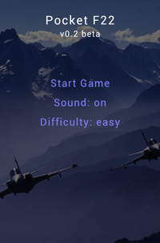
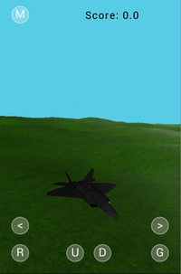

Pocket F22 (Android)
====================

A simple flight simulator game on Android using OpenGL ES 2.0.

The project was created for educational purposes (school project / thought I could share it as an example of how to use OpenGL ES 2).

Warning: alpha quality (the game is only partially implemented, although the main engine/framework is fairly complete).

Licensed as Public Domain.

How to run
----------

You need either [Android Studio](http://developer.android.com/tools/studio/index.html) (v1.0) or [Gradle](https://gradle.org/) (for command line support).
And [Android SDK](http://developer.android.com/sdk/index.html), of course.

The project files and gradle installation scripts are included.

You can build it and run inside an emulator/phone using the following command line: 

	gradlew
	adb ­s <device> install <application>.apk

Features
--------

Project/code highlights:

* Custom-built 3D mini-engine with utility classes such as .obj loader, text drawing library etc.;
* 2D HUD elements such as menu buttons, text that can be overlayed over a 3D scene;
* MVC-based architecture with model abstractions of the game;
* Automatic terrain generation using fractal algorithms;
* Collision detection implementation using AABBs.

Still unfinished:

* aircraft control via accelerometer;
* multiple types of missiles;
* multiple terrain types / dynamic world;
* artificial intelligence for the enemy airplanes;
* performance optimizations / debugging.

